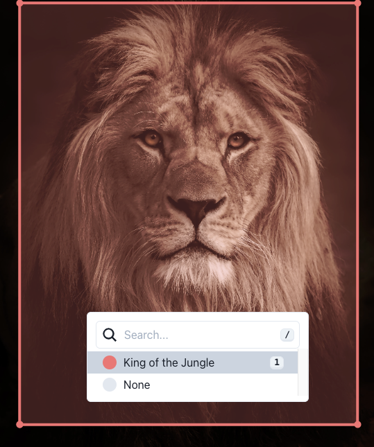

# Intro to LabelFlow

## What is LabelFlow?

At LabelFlow we are on a mission to build the fastest labeling interface on the internet!

Our mission is to provide the AI community with a solution that seamlessly integrates within their software ecosystem while providing the most straightforward labeling experience.  LabelFlow is also open source because involving the users helps us build a better platform that they will like. It doesn’t hurt that it improves our image too 😉.

Based on years of experience working in the energy space helping utility companies identifying hazards on the grids, we clearly figured out that it was possible to bring AI at scale on complex use cases, saving time and increasing reliability. There is a “BUT”, there is no secret sauce: the dataset must be large, homogeneous AND accurately labeled.

Head on to Quick Start and let us take a test case to see how you can leverage LabelFlow to bring your machine learning models at scale today!

