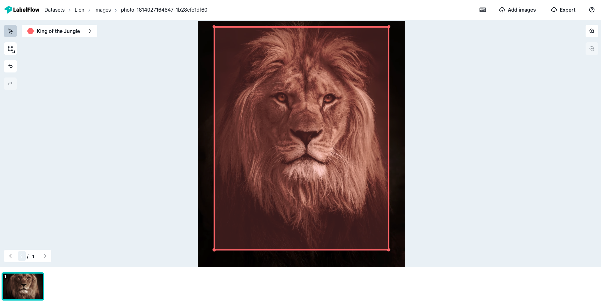

# Intro to LabelFlow

## What is LabelFlow?

At LabelFlow we are on a mission to build the fastest labelling interface on the internet!

Our mission is to provide the AI community with a solution that seamlessly integrates within their software ecosystem while providing the most straightforward labelling experience.  Labelflow is also [open source](https://github.com/Labelflow/labelflow) because involving the users helps us build a better platform FOR the users. 

Based on years of experience working in the energy space helping utility companies to identify hazards on power grids, we clearly figured out that it was possible to bring AI to scale in complex use cases, saving time and increasing reliability. However, there is a “BUT”. There is no secret sauce: the dataset must be large, homogeneous AND accurately labeled.

Head on over to [Quick start ](https://app.gitbook.com/@labelflow/s/labelflow/labeling-interface/quick-start)and let us take a test case to see how you can leverage LabelFlow to bring your machine learning models to scale today!

