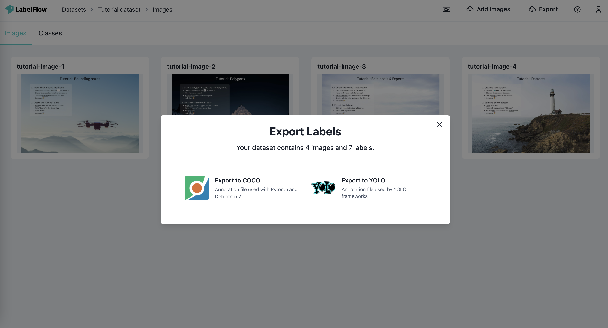
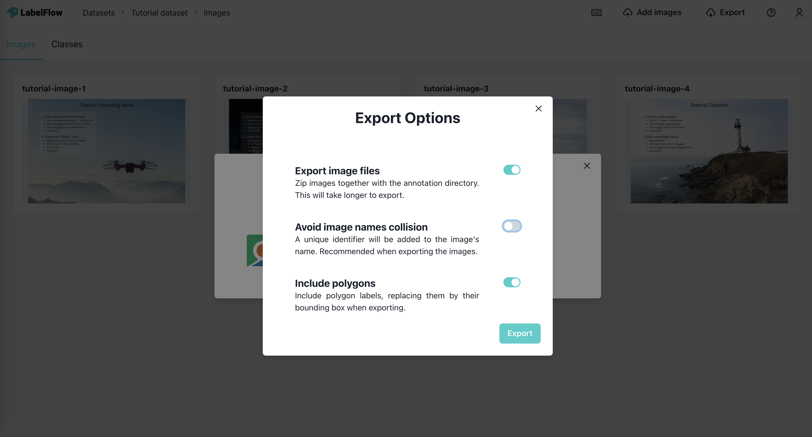

# 👁 YOLO

### Exporting your labels

You Only Look Once, or YOLO is a widely used labeling format, where a .txt file is created for each image file in the same directory. Each .txt file contains the annotations for the corresponding image file, that is object class, object coordinates, height, and width.

Once you are finished with your labeling project, select the export tool on the top right.

A small pop-up will appear with information about the number of labels and prompts you to specify the export format. Select the YOLO file type and it will download your labels in the YOLO format.

### Exporting Images&#x20;

As an option, you can export the images together with the YOLO detection file in a zip file.


Note that it may take several minutes ⏱ when you export the images of a large dataset (1000+ images).


