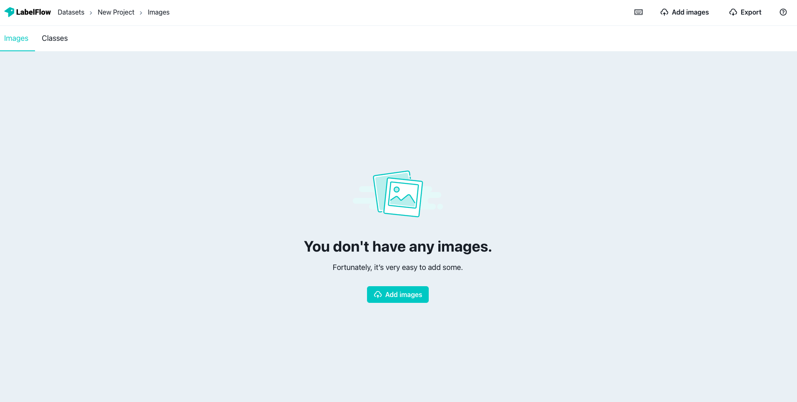
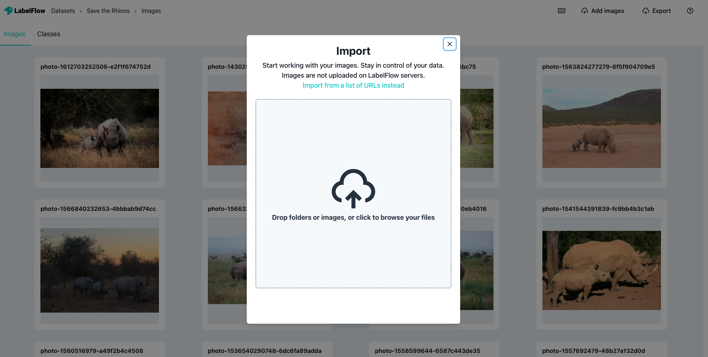
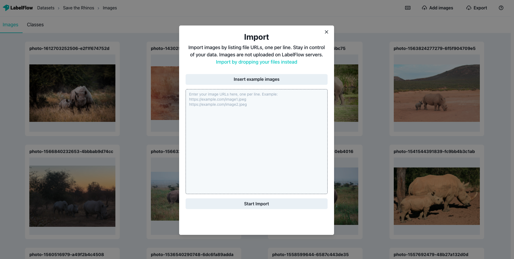

# Datasets

Each labeling project has its own dataset which is a collection of images that are prepared to be labeled.

You can add images to your dataset by clicking the "add images" button on the top right of the images page.

When you create a new project, you are greeted with the suggestion to add images to your dataset.

### Upload Images

You can upload your images to Labelflow from your local computer or your online database. To upload from your local machine, drag and drop the images directly to the website.

If you want draw the images your online database or from anywhere on the internet, simply press "import from a list of URLs instead" button. Copy and paste the image URLs and select "Start Import". It's that easy.👌

