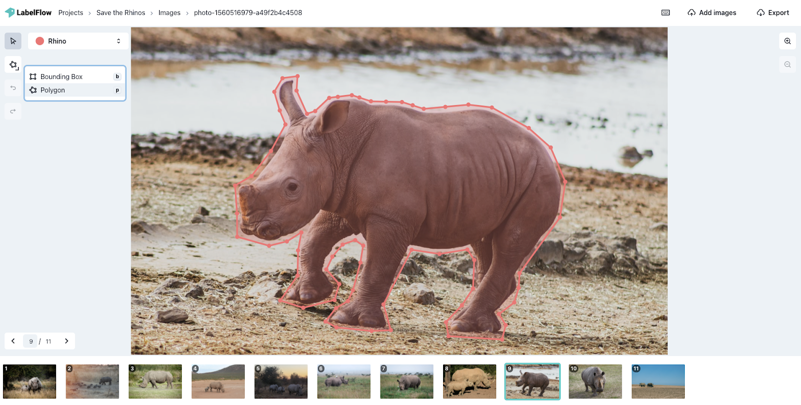

# Polygons

The polygon label type is defined by several vertices, which allows the user to accurately label complex shapes.

By definition, polygon labels are closer in shape to the subject of the label than a simple bounding box.

These are the simple steps you need to take to make a polygon label:

1. Click on the arrow on the bottom right of the label tool on the left
2. Select the polygon tool 
3. Click on the outermost edge of the subject of the label
4. Follow the edges of the subject and select the vertices of the polygon
5. When you are finished click on the vertex near the pointer and the polygon will be created


You can create vertices and move existing ones to change the shape and size of the polygon!

* Add vertices to the polygon by selecting an edge and dragging the vertex that appears
* Select and drag an existing vertex to move it


