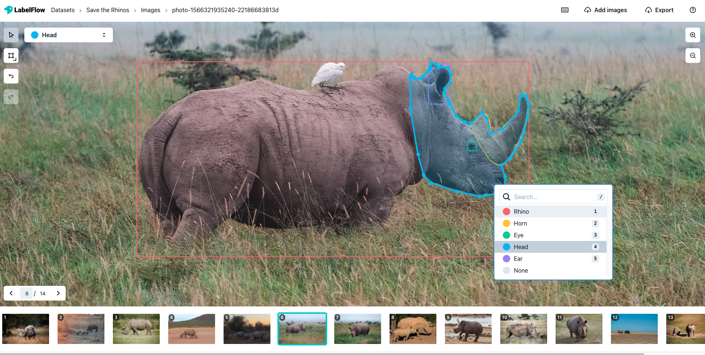

# Quick start

Let us take the case that you are making an AI model that identifies rhinos from an image for wildlife protection services. You need to train your model with high-quality labeled images so you can produce an effective tool against poaching. These are the steps you can follow to get prepare the high-quality labeled images.

### 1. Gather Image Dataset

The first step is to gather a dataset of images containing rhinos. You can save it online or store it locally on your computer. Your data stays in its original location during the entire project so that you are in control of your data.

### 2. Create a project for your data set

Navigate to [LabelFlow](www.labelflow.ai) and you will be welcomed with this interface. Press “Start Labeling”. Click on “Create new project” and give your project a name. Now press “Start Labeling” and enter your project.

### **3. Import your images**

Press “Add images” and you drop all the images that you will label for this project. You can drag and drop the images onto the screen or paste the URL to your database. You can also drop the URL to your database if your images are on the cloud.

It will lead you to a gallery where you can see all your pictures.""

Select the image you would like to label first and away we go!  

### 4. Label Images

#### Bounding Box

Select the bounding box tool and click on the edges of the Rhinos you would like to label. Two guiding lines will be available to help you select the edges. Right-click on the bounding box to specify the class of the label. Labels are colored by class for convenience.  

#### Polygon

Select the small arrow on the drawing tool and choose the polygon tool. Draw a polygon around the rhino and adjust the vertices at the end by dragging them.

Navigate between your images by simply choosing the next image you would like to label or clicking the small arrows at the bottom left. You can also use the left and right arrow keys.


Click on the keyboard icon on the top right to see the complete list of shortcuts


Labels can overlap, intersect or encompass other labels. Zoom in on your images by using the top right button or by using the trackpad.  
Create as many label classes as you need.  

### 5. Export Labels

Once you are finished, select the export tool on the top right.

This will give you a small menu with information about the number of labels and allows you to specify the export format, including [COCO](https://cocodataset.org/#home).

Select your desired file type and it will download to your device.

Now you are ready to train your AI model! It’s that easy! 👌  

