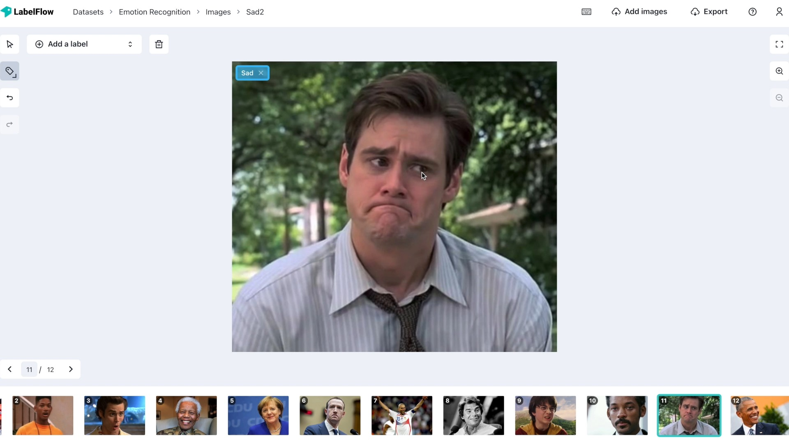

# Image classification

The classification label type is the simplest and quickest way to label images. As opposed to the bounding box and polygon label types, the classification type doesn't have an associated geometry within the image.   
  
This label type simply consists of a general label for the entire image. 

These are the simple steps you need to take to make a classification label:

1. Select the small arrow on the drawing tool on the left and select the classification tool
2. Click on the label box in the top left of the image or right-click on the image to select/add its class

It's that easy! 


Check out the [shortcuts](https://app.gitbook.com/@labelflow/s/labelflow/~/drafts/-MlAX79SpjAP8ghFZFqm/labelling-interface/shortcuts) page to find out how to increase your productivity! 


